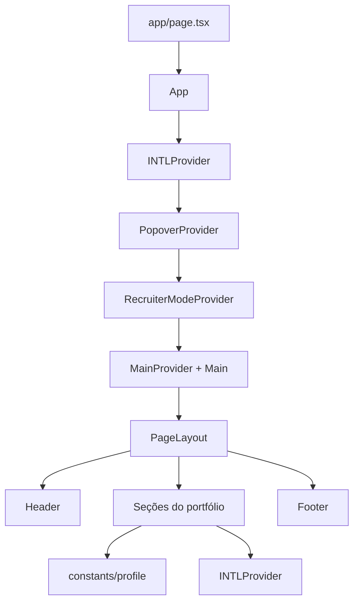

# Aplicação

## Papel e execução

A aplicação é uma SPA React 19 executada pelo Next.js com App Router. Ela apresenta o perfil, projetos, experiências, depoimentos e ações de contato. Em desenvolvimento e produção, usa a porta `5173` pelos scripts da raiz.

```bash
npm run dev
npm run build
npm run lint
```

O ponto de entrada do App Router é `src/app/`: `layout.tsx` define o documento e metadata, `page.tsx` monta a aplicação e `globals.css` carrega os estilos existentes. A composição de providers está em `src/App.tsx`; a página atual é `src/screens/Main/main.tsx`.

`layout.tsx` e `page.tsx` são Server Components. `App.tsx` é a fronteira client-side temporária, pois a SPA atual compartilha idioma, tabs, popovers, navegação por hash e arte ASCII. Não adicione `"use client"` a `app/` sem necessidade; extraia uma seção dessa fronteira somente quando seu conteúdo e tradução puderem ser fornecidos pelo servidor sem mudar a interação.

## Estrutura

| Área | Onde procurar | Regra prática |
| --- | --- | --- |
| Página e composição | `src/app/` e `src/screens/` | `app/page.tsx` monta a rota `/`; `screens/Main` define a ordem das seções. |
| Seções de conteúdo | `src/sections/` | Cada seção rende uma parte do portfólio (`About`, `Skills`, `Projects`, `Experiences`, `Testimonials` e `Congratulations`). |
| Componentes reutilizáveis | `src/components/` | `action` contém controles, `general` primitivas, `layout` estrutura, `text` tipografia e `wrapper` comportamento visual. |
| Features | `src/features/` | Fluxos de produto como métricas, feedback e recruiter mode. |
| Estado transversal | `src/providers/` | Internacionalização e modo recrutador. |
| Dados editoriais | `src/constants/profile/` | Fonte de perfil, skills, projetos, experiências, depoimentos e links de navegação. |
| Texto traduzível | `src/constants/intl/terms.ts` | Registro de termos PT/EN consumido por `useINTLContext().t(...)`. |
| Comportamento reutilizável | `src/hooks/`, `src/utils/` | Hooks de UI/navegação e funções puras. |
| APIs internas | `src/app/api/` | Route Handlers do Next; há health check em `api/health/route.ts`. |
| Backend interno | `backend/` | Código server-only de domínio e infraestrutura, incluído no build do Next. |

Arquitetura de renderização atual:



## Convenções de código

- Pastas de componentes, hooks e módulos usam `main.tsx` ou `main.ts` para implementação, `types.ts` para contrato e `index.ts` para exportação pública. Em subáreas, há barrels adicionais para agrupamento.
- Use `@/` para módulos em `src/` e `@backend/` para módulos server-only em `backend/`; não atravesse a fronteira com imports relativos longos.
- `PropsWithClassName` e tipos comuns ficam em `src/utils/types/`; classes condicionais devem usar `cn` de `src/utils/tailwind`.
- Tailwind v4 é carregado por `@tailwindcss/postcss`. `src/app/globals.css` importa `src/index.css`, onde vivem os tokens `ud-*`, incluindo cores, espaçamento, sombras, z-index e animações. Reutilize tokens antes de criar valores arbitrários.
- A navegação de seção é baseada em hashes. `useHashNavigation` e `scrollToHash` cuidam do scroll e do offset do header; links novos precisam acompanhar `GROUP_SECTION_LINKS` em `constants/profile/page.ts` e um `id` compatível na seção.
- O projeto usa TypeScript estrito para símbolos não usados no frontend. Rode lint e build depois de alterar imports ou tipos.

## Conteúdo e internacionalização

O frontend é guiado por dados: não espalhe fatos de perfil ou strings de interface em componentes quando eles podem viver nos registros abaixo.

- `about.tsx`: nome, papéis, descrição e links sociais.
- `skills.ts`: vocabulário de skills e tabs por `SkillKind`.
- `projects.tsx` e `experiences.tsx`: itens, categorias, datas, links e tags.
- `testimonials.ts` e `page.ts`: depoimentos e estrutura de navegação.
- `terms.ts`: cada termo suporta ao menos PT/EN e pode receber interpolação.

Hoje as skills de experiências são `TagEntry` literais, e projetos possuem `skill?` singular que ainda não é preenchido. A [spec do recruiter mode](recruiter-mode/spec.md) propõe centralizar esse vocabulário antes de implementar matching; não crie uma terceira fonte de skills.

## Estado e integração com a API

`INTLProvider` oferece idioma e `t(term, variables)`. `RecruiterModeProvider` expõe apenas o booleano `isRecruiterMode` e operações de mudança; por enquanto, as seções não reagem a ele. O botão de formulário de recrutador é montado pelo provider para toda a aplicação.

`GET /api/health` está em `src/app/api/health/route.ts` e não é uma dependência de renderização da página principal. Não há API ou servidor separado fora do Next.

`backend/libs/db/mongo` exporta `getMongoClient()` e `getMongoDb()` para Route Handlers e Server Components. O módulo importa `server-only`, reutiliza a conexão durante o hot reload e só exige `MONGO_URL` quando alguma rota realmente acessa o banco. Copie `.env.example` para `.env.local` e não use o prefixo `NEXT_PUBLIC_` nessa variável.

Os modelos de cada domínio ficam junto do módulo: métricas usam `backend/metrics/models/`. Use `getLikesCollection(await getMongoDb())` e `getViewsCollection(await getMongoDb())` dentro de código server-side. `View` agora aponta para a coleção `views`, corrigindo o helper antigo que, por engano, apontava views para `likes`.

O idioma inicial é `ptbr` no servidor para manter a hidratação determinística. Depois da hidratação, `INTLProvider` restaura a preferência salva em `localStorage`.

## Metadata e publicação

O metadata base fica em `src/app/layout.tsx`, com ícone, Open Graph e Twitter Card. A imagem social é gerada em `src/app/opengraph-image.tsx`, sem depender de asset raster adicional.

Defina `NEXT_PUBLIC_SITE_URL` no ambiente de produção com a URL canônica do deploy. Sem essa variável, o projeto usa a URL pública atualmente registrada no portfólio como fallback.

As métricas do header são valores estáticos. Métricas e serviços de projeto continuam pontos de extensão, não fontes funcionais de dados; os stubs anteriores foram retirados sem publicar um contrato vazio.

## Trabalho em andamento: arte ASCII

Há mudanças locais não commitadas para converter imagens de perfil em arte de caracteres. A implementação centraliza a conversão em `src/utils/ascii/imageToAscii.ts`, a apresentação em `components/general/AsciiArt` e hooks em `hooks/media` e `hooks/observer`. A especificação funcional está em `ACII.spec.md`. Preserve esses arquivos ao trabalhar em outras áreas e mantenha a conversão como mecanismo compartilhado, não duplicado por seção.

## Onde encaixar mudanças comuns

| Necessidade | Local inicial |
| --- | --- |
| Nova seção no portfólio | `src/sections/`, depois `screens/Main/main.tsx`, links de `constants/profile/page.ts` e termos. |
| Novo componente visual | `src/components/` na categoria adequada; só crie uma feature se houver fluxo de produto próprio. |
| Novo texto | `src/constants/intl/terms.ts`. |
| Novo dado de perfil | `src/constants/profile/`, mantendo tipo explícito. |
| Novo endpoint consumido | `src/app/api/` para Route Handlers ou uma feature/service próxima ao domínio; documente o contrato e mantenha o consumidor em `fetch`. |
| Mudança no modo recrutador | Leia primeiro `docs/recruiter-mode/spec.md`; o objetivo é reorganizar fatos existentes, sem inventá-los. |
